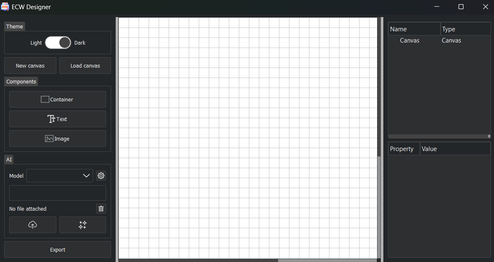

# ECW Designer


## Overview

ECW Designer is a PyQt5-based graphical user interface (GUI) application designed for visually creating and managing UI components or report layouts. It allows users to arrange elements, define their properties, and export/import these designs, providing a flexible tool for building structured visual content.



## Features

*   **Visual Design Interface**: Drag-and-drop functionality for placing and arranging components on a canvas.

*   **Component Management**: Define and adjust properties such as position, size, and size policies for various UI elements (e.g., Containers, Text, Images).

*   **JSON Export/Import**: Save and load designs using a structured JSON format, enabling easy sharing and persistence of layouts.

*   **Robust Error Handling**: Includes a custom exception hook to catch unhandled errors and display critical messages to the user, enhancing application stability.

*   **Splash Screen**: Provides a loading splash screen on application startup (especially useful for bundled applications).

*   **Custom Application Icon**: Features a custom icon for better branding and user experience.

## Changelog

See [CHANGELOG.md](CHANGELOG.md)

## Installation

To set up and run ECW Designer, follow these steps:

### Prerequisites

*   Windows 10+
*   Python 3.x

*   `pip` (Python package installer)

### Steps

1.  **Clone the repository**:


```bash
    git clone https://github.com/omicron91/ecw_designer.git

    cd ecw_designer
```


2.  **Install dependencies**:

```bash
    pip install -r requirements.txt
```

## Usage

To run the ECW Designer application from the root folder:

```bash
    cd src/
    python ecw_designer.py
```

## Bundling

To compile modules into dynamic link libraries and package the files from the root folder:

```bash
    python setup.py build_ext --inplace
    python py2exe/generate_exe
```

*The bundled folder should be inside py2exe/dist/*

*In order to compile your modules, if you modify the code you will not see the changes at runtime until you compile it again.*

Once launched, you can:

*   Add new components to the canvas.

*   Drag and resize components.

*   Configure component-specific properties.

*   Save your design to a JSON or PDF file.

*   Load existing designs from a JSON file.

## Project Structure

*   `src/`: Contains the main application source code.

    *   `src/ecw_designer.py`: The main entry point of the application.

    *   `src/app/`: Core application logic, including UI components and design handling.

    *   `src/assets/`: Static assets like icons and images.

*   `output.log`: Log file for application events and errors.

## License

[License GPL](LICENSE)
